# Counting axions with IAXO
[](https://opensource.org/licenses/MIT)
[](https://arxiv.org/abs/2606.XXXXX)

Code and data to reproduce the results and figures of **"Counting axions with IAXO"**,
by B. Grinstein, C. Miró, and P. Quílez ([arXiv:2606.XXXXX](https://arxiv.org/abs/2606.XXXXX)).

If more than one axion couples to photons, their combined signal in a helioscope may
mimic that of a single axion. This work studies whether a next-generation helioscope
such as IAXO could tell them apart, exploiting the spectral imprint of *axion flavor
oscillations* on the converted X-ray spectrum.

The analysis was carried out **independently in two complementary ways that cross-check
each other**: a binned likelihood analysis (`binned/`, C. Miró) and an unbinned one
(`unbinned/`, P. Quílez), together with the spectra notebooks (`spectra/`). The figures
below are reproduced by clicking on the corresponding notebook(s).

For questions, write to pablo.quilez@cern.ch or carlos.miroarenas@to.infn.it.

## Citation

If you use this code or data, please cite:

```bibtex
@article{CountingAxionsIAXO,
    author  = "Grinstein, Benjam\'in and Mir\'o, Carlos and Qu\'ilez, Pablo",
    title   = "{Counting axions with IAXO}",
    eprint  = "2606.XXXXX",
    archivePrefix = "arXiv",
    primaryClass  = "hep-ph",
    year    = "2026"
}
```

<details>
<summary><b>Requirements</b></summary>

Python 3 with Jupyter and the standard scientific stack: `numpy`, `scipy`, `matplotlib`, `palettable`.

The summary plot also overlays haloscope bounds and projections using `PlotFuncs.py` and the data in `limit_data/`, taken from [cajohare/AxionLimits](https://github.com/cajohare/AxionLimits).

</details>

<details>
<summary><b>Repository structure</b></summary>

- **`binned/`** — binned likelihood analysis (C. Miró).
- **`unbinned/`** — unbinned likelihood analysis (P. Quílez).
- **`spectra/`** — notebooks producing the two-axion photon spectra.
- **`plots/`** — all paper figures (`.pdf` and `.png`).
- **`data/`** — shared input data.

</details>

---

# Figures

## Fig. 1
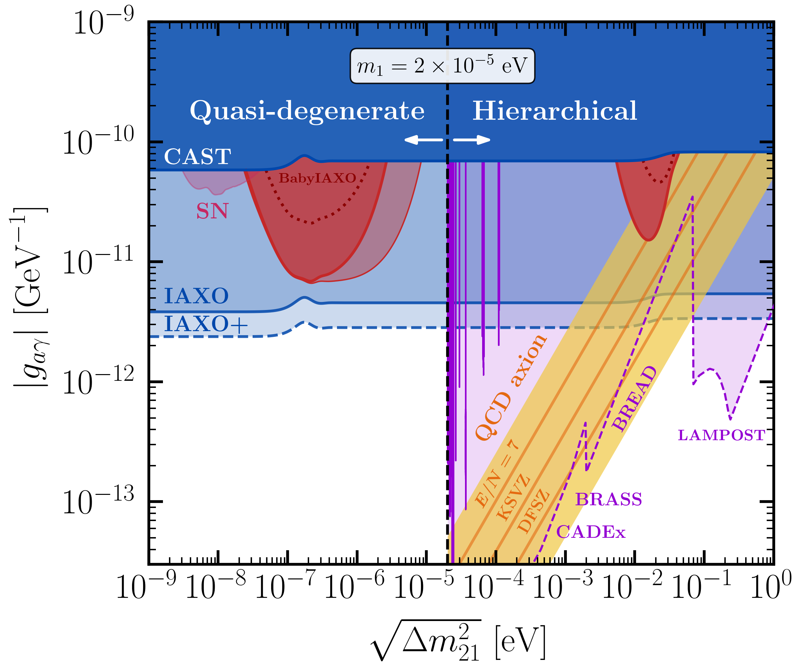

[Unbinned notebook](unbinned/plot_summary.ipynb) · [Binned notebook](binned/Summary.ipynb)

Two-axion discrimination regions (red) in the quasi-degenerate regime
$\Delta m_{21}^2\ll m_{1,2}^2$ and hierarchical regime $m_1^2 \ll m_2^2 \simeq \Delta m_{21}^2$.
The solid red curves indicate the discrimination reach at IAXO, while the dotted lines
assume the BabyIAXO configuration. The small pink region on the left is the discrimination
region from the same analysis using supernova axions. CAST exclusion limits at 95% CL are
shown in blue, with IAXO/IAXO+ projections in light blue. The window for *preferred* QCD
axion models is shown in yellow. Since in the hierarchical regime the mass splitting is
essentially the mass of the heaviest axion, haloscope searches (violet) and projections
(light violet) are also included.

## Fig. 2
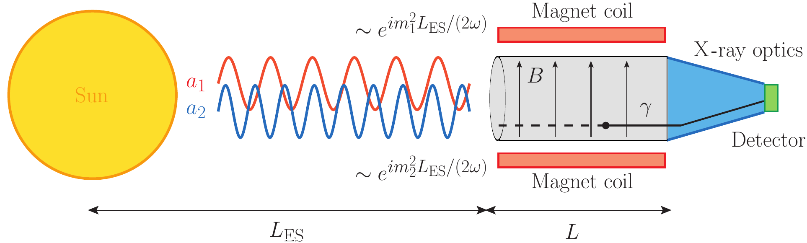

*(schematic — not generated by a notebook)*

Schematic of a two-axion helioscope. The interaction state $a_\gamma$ is produced in the
Sun and propagates as a superposition of two mass eigenstates $a_1$ and $a_2$, which
accumulate different phases over the Earth-Sun distance $L_\mathrm{ES}$. Upon entering the
magnet of length $L$ and field strength $B$, the axions convert into X-ray photons. The
different accumulated phases generate an interference pattern that imprints oscillatory
features on the detected photon energy spectrum, which can be exploited to discriminate the
two-axion scenario from the single-axion case.

## Fig. 3
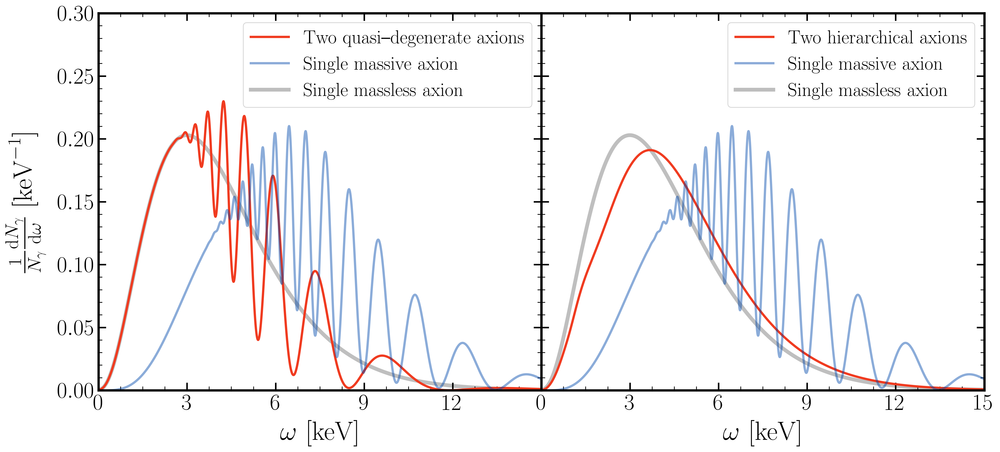

[Spectra notebook](spectra/plot_spectra.ipynb) · [Notebook](binned/Spectra.ipynb)

Normalized differential photon spectrum for the quasi-degenerate (*left*) and hierarchical
(*right*) two-axion scenarios (red), compared to a single massless axion (gray) and a
single massive axion (blue). Benchmark parameters: $m_a = 10^{-1}$ eV for the massive
single-axion theory, $m_2 = 10^{-3}$ eV and $\sqrt{\Delta m_{21}^2} = 7\times 10^{-7}$ eV
for the quasi-degenerate regime, and $\sqrt{\Delta m_{21}^2} \simeq m_2 = 1.5\times 10^{-2}$ eV
for the hierarchical regime. Equal photon couplings ($\varphi = \pi/4$) are assumed.

## Fig. 4
<p float="left">
  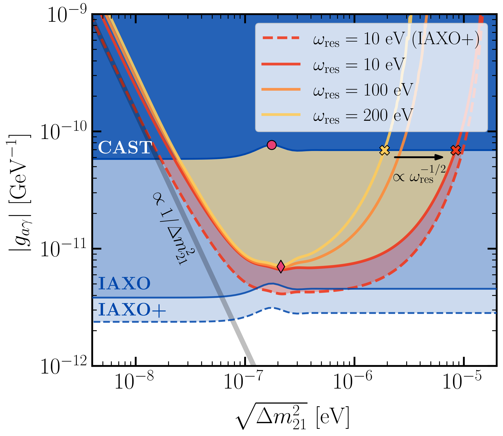
  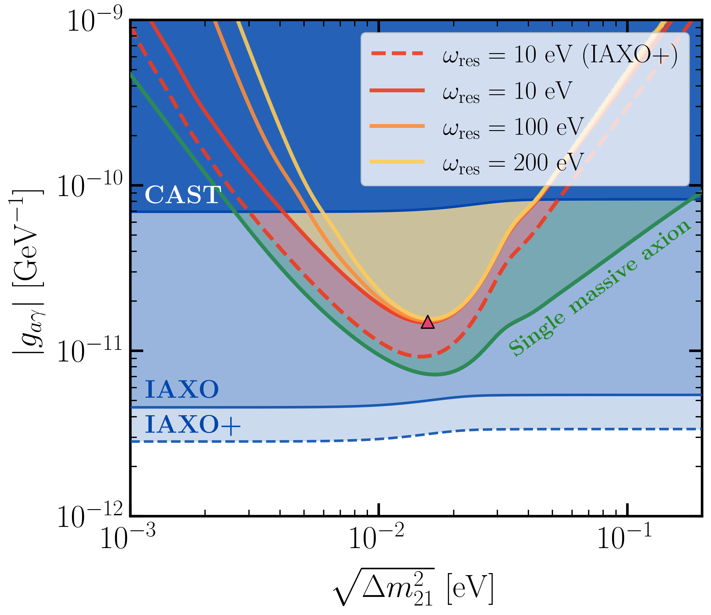
</p>

[Unbinned quasi-degenerate](unbinned/run_quasi_degenerate.ipynb) ·
[Unbinned hierarchical](unbinned/run_hierarchical.ipynb) ·
[Binned notebook](binned/Discrimination.ipynb)

Two-axion discrimination reach (shaded yellow) for equal photon couplings $\varphi = \pi/4$
in the quasi-degenerate (*left*) and hierarchical (*right*) regimes. The solid blue curve is
the CAST exclusion limit, the light blue band marks IAXO/IAXO+ projections, and the yellow,
orange and red lines show $g_{a\gamma}^\mathrm{dis}$ at $3\sigma$ for energy resolutions
$\omega_\mathrm{res} = 10, 100, 200$ eV (IAXO+ dashed red). *Left:* markers indicate the
optimal discrimination point and the mass splitting with the weakest exclusion limit; the
maximum mass splitting probed scales as $\omega_\mathrm{res}^{-1/2}$. *Right:* the green line
marks where IAXO can measure the single axion mass.

## Fig. 5
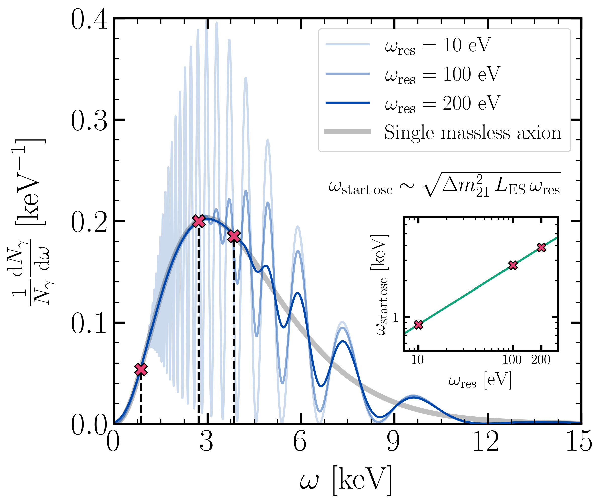

[Notebook](binned/Resolution.ipynb)

Effects of the finite energy resolution of the detector on the photon spectrum in the
quasi-degenerate regime. The cross marks indicate the energy that triggers the start of the
oscillations for different resolutions. The inset illustrates the dependence
$\omega_\mathrm{start\,osc} \sim \sqrt{\omega_\mathrm{res}}$ for a fixed axion mass difference.

## Fig. 6
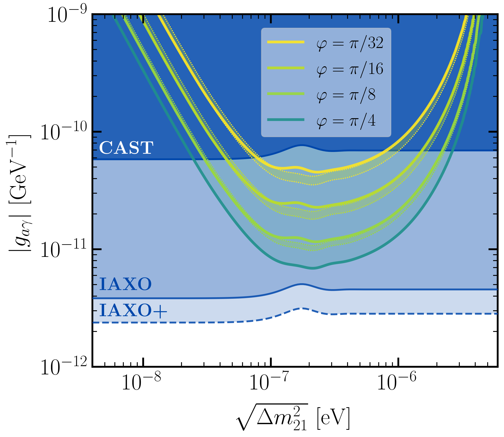

[Unbinned notebook](unbinned/run_mixing_angle.ipynb) · [Binned notebook](binned/Mixing-angle.ipynb)

Dependence of the two-axion discrimination region on the mixing angle in the quasi-degenerate
regime. The solid lines are the full numerical results for $\varphi = \pi/4, \pi/8, \pi/16, \pi/32$.
The lower dotted envelopes follow $g^\mathrm{dis}_{a\gamma} \propto 1/\sin 2\varphi$ for small
mass differences, while the upper envelopes follow
$g_{a\gamma}^\mathrm{dis} \propto (2 - \sin^2 2\varphi)^{1/4}/\sin 2\varphi$ for large mass splittings.

## Fig. 7
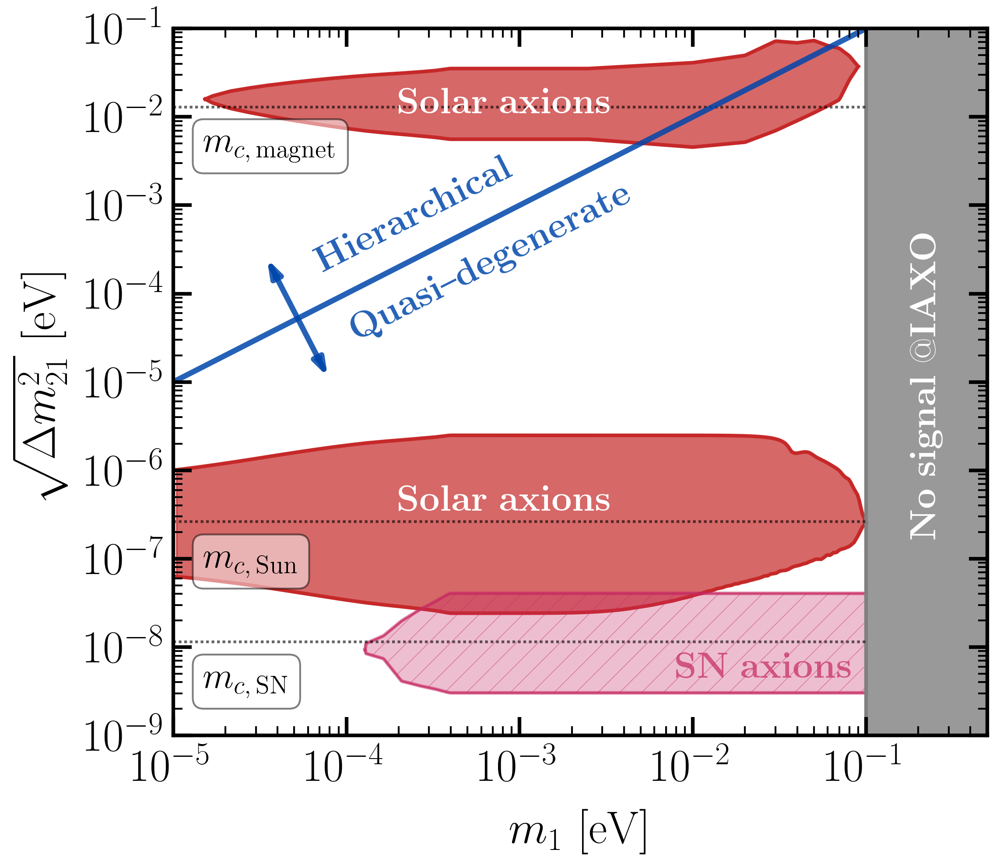

[Notebook](binned/Mass-regimes.ipynb)

Two-axion discrimination regions in the $\sqrt{\Delta m_{21}^2}$ vs $m_1$ plane, with $m_1$
the mass of the lightest axion, from the analysis with solar axions (red) and SN axions
(hatched pink). The blue line separates the quasi-degenerate regime
$\sqrt{\Delta m_{21}^2} \simeq m_{1,2}$ from the hierarchical regime
$m_1 \ll \sqrt{\Delta m_{21}^2} \simeq m_2$. The gray region marks the mass interval where
IAXO cannot detect any signal.

## Fig. 8
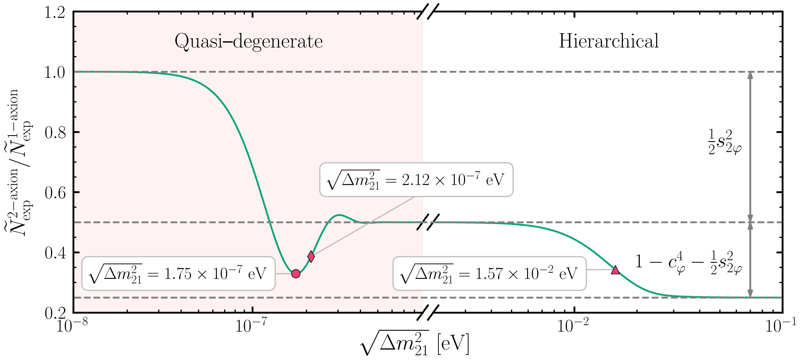

[Notebook](binned/Nexp_evolution.ipynb)

Expected number of photons, normalized to the single-axion prediction, in the quasi-degenerate
(*left*) and hierarchical (*right*) mass regimes for equal photon couplings $\varphi = \pi/4$.
The markers indicate the optimal discrimination points and the mass splitting with the smallest
number of counts. *(Appendix figure.)*

## Fig. 9
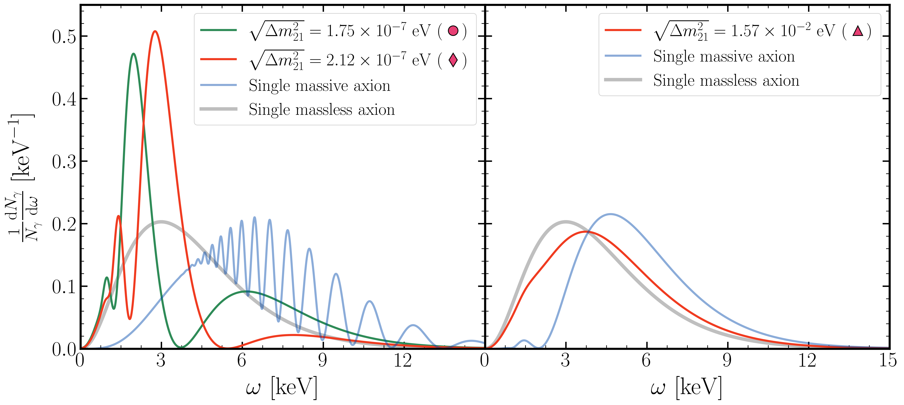

[Notebook](binned/Spectra_Appendix.ipynb)

Normalized differential photon spectrum for the quasi-degenerate (*left*) and hierarchical
(*right*) two-axion scenarios, compared to a single massless axion (gray) and a single massive
axion (blue). *Left:* the green curve is the spectrum where the number of photon counts is
minimal, the red curve the one ensuring optimal discrimination. *Right:* the red curve gives
optimal discrimination in the hierarchical regime, compared to the single massive axion. *(Appendix figure.)*

## Fig. 10
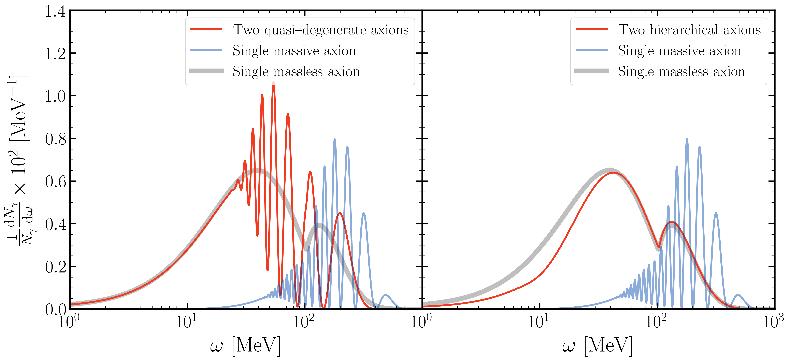

[Notebook](binned/Spectra.ipynb)

Normalized differential photon spectrum for the quasi-degenerate (*left*) and hierarchical
(*right*) supernova two-axion scenarios (red), compared to a single massless axion (gray) and a
single massive axion (blue). *(Appendix figure.)*

## Fig. 11
<p float="left">
  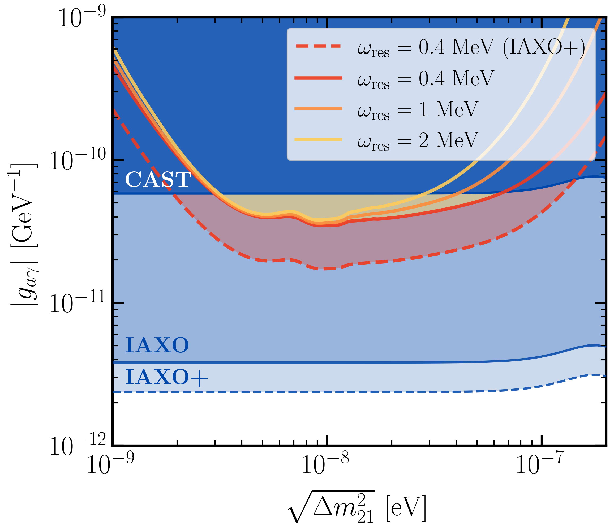
  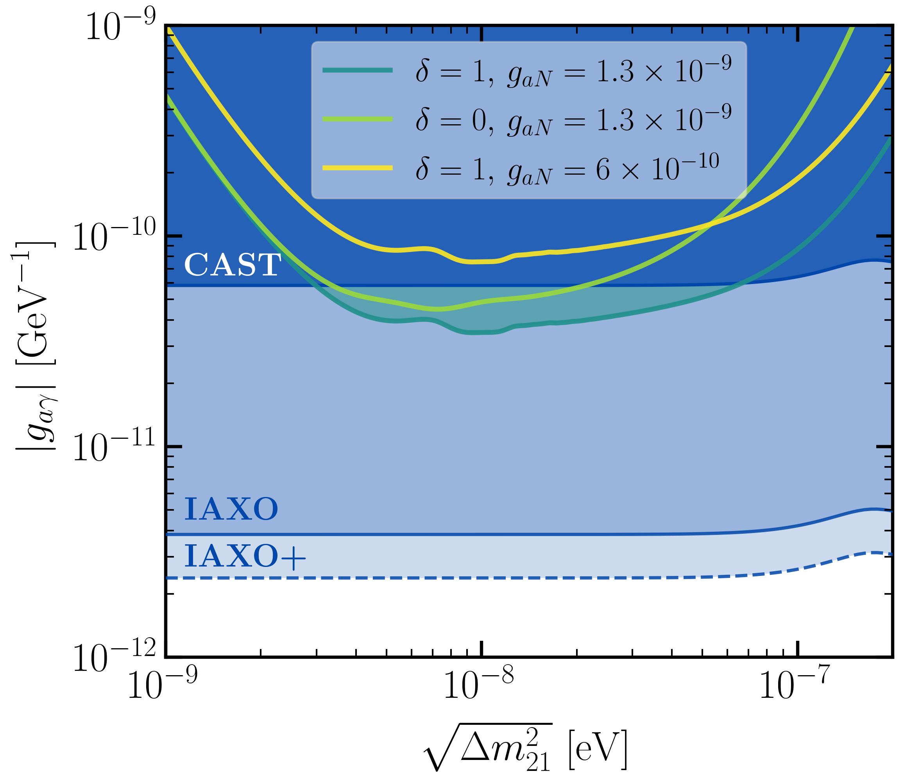
</p>

[Notebook](binned/Discrimination.ipynb)

Two-axion discrimination reach from the analysis with SN axions in the quasi-degenerate regime.
*Left:* $g_{a\gamma}^\mathrm{dis}$ at $3\sigma$ for energy resolutions
$\omega_\mathrm{res} = 0.4, 1, 2$ MeV ($\delta = 1$, $g_{aN} = 1.3\times 10^{-9}$). *Right:* the
three benchmark scenarios at $\omega_\mathrm{res} = 0.4$ MeV. *(Appendix figure.)*

---


## Acknowledgements

Haloscope bounds and projections shown in the summary plot are taken from
[cajohare/AxionLimits](https://github.com/cajohare/AxionLimits) (C. O'Hare). The single
massive axion mass-measurement reach is from the open data of Dafni et al.
([arXiv:1811.09290](https://arxiv.org/abs/1811.09290)).
